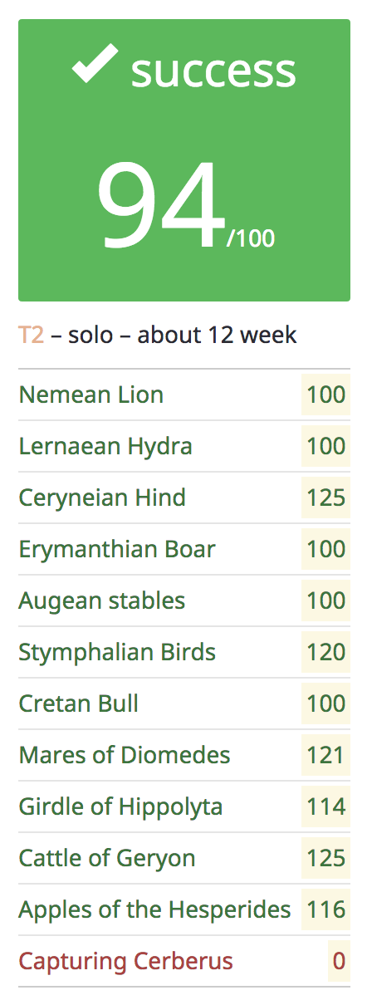

# École 42

## Hercules

This project is a set of sub-projects, seeking to get us out of our comfort
zone by programming in other languages instead of just focusing in C.
It lasts for 12 weeks, "recreating" the infamous labors that Hercules had to
complete. One labor per week, and each labor only lasts for twelve hours.
As of now, it includes the following sub-projects:

### Labors

* [Nemean Lion](lion/)
* [Lernaean Hydra](hydra/)
* [Ceryneian Hind](hind/)
* [Erymanthian Boar](boar/)
* [Augean Stables](stables/)
* [Stymphalian Birds](birds/)
* [Cretan Bull](bull/)
* [Mares of Diomedes](mares/)
* [Girdle of Hippolyta](girdle/)
* [Cattle of Geryon](cattle/)
* [Apples of Hesperides](apples/)
